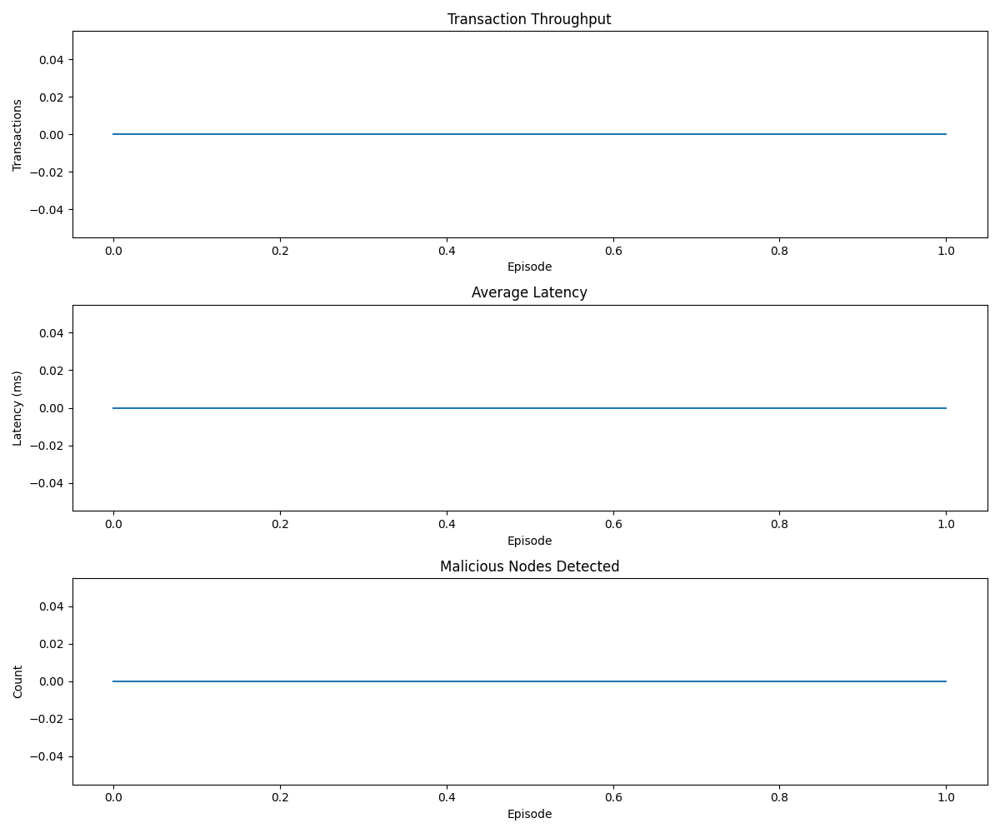

# Q-TRUST API Documentation

## Overview

Q-TRUST is a blockchain sharding framework using Deep Reinforcement Learning (DRL) to optimize performance and security. This documentation provides detailed information about the APIs and how to use the system's modules.

<div align="center">
  
</div>

This documentation details the APIs and components of the Q-TRUST system, helping developers understand and extend the system.

## 📚 Table of Contents

- [Architecture Overview](#architecture-overview)
- [Core Modules](#core-modules)
  - [BlockchainEnvironment](#1-blockchainenvironment)
  - [DQNAgent](#2-dqnagent)
  - [AdaptiveConsensus](#3-adaptiveconsensus)
  - [MADRAPIDRouter](#4-madrapidrouter)
  - [HTDCM](#5-htdcm-hierarchical-trust-data-center-mechanism)
  - [FederatedLearning](#6-federatedlearning)
- [Utilities](#utilities)
- [Data Flow](#data-flow)
- [Advanced Guides](#advanced-guides)
  - [Custom Agents](#custom-agents)
  - [Custom Environments](#custom-environments)
  - [Creating Custom Simulations](#creating-custom-simulations)
- [Result Analysis](#result-analysis)
- [Visualization](#visualization)

## Architecture Overview

Q-TRUST consists of multiple modules working together to form a comprehensive blockchain sharding optimization system:

<div align="center">
```
                          ┌───────────────────┐
                          │  BlockchainEnv    │
                          └─────────┬─────────┘
                                    │
                                    ▼
┌───────────────────┐     ┌───────────────────┐     ┌───────────────────┐
│  AdaptiveConsensus│◄────┤     DQNAgent      ├────►│    MADRAPIDRouter │
└───────────────────┘     └───────────────────┘     └───────────────────┘
                                    │
                                    ▼
┌───────────────────┐     ┌───────────────────┐
│FederatedLearning  │◄────┤      HTDCM        │
└───────────────────┘     └───────────────────┘
```
</div>

### Data Flow and Interaction

1. **BlockchainEnvironment** provides network state to the **DQNAgent**
2. **DQNAgent** makes decisions about routing and consensus protocols
3. **AdaptiveConsensus** applies the appropriate consensus protocol
4. **MADRAPIDRouter** handles transaction routing based on agent decisions
5. **HTDCM** evaluates the trustworthiness of network nodes
6. **FederatedLearning** supports knowledge distribution between agents

## Core Modules

### 1. BlockchainEnvironment

Blockchain simulation environment with sharding, providing an interface for interaction between agents and the blockchain network.

#### Class: BlockchainEnvironment

```python
from qtrust.simulation.blockchain_environment import BlockchainEnvironment

# Create environment
env = BlockchainEnvironment(
    num_shards=4,                   # Number of shards
    num_nodes_per_shard=10,         # Nodes per shard
    max_transactions_per_step=100,  # Maximum transactions per step
    transaction_value_range=(0.1, 100.0),  # Transaction value range
    max_steps=1000,                 # Maximum steps per episode
    latency_penalty=0.5,            # Latency penalty coefficient
    energy_penalty=0.3,             # Energy penalty coefficient
    throughput_reward=1.0,          # Throughput reward coefficient
    security_reward=0.8             # Security reward coefficient
)

# Reset environment
state = env.reset()

# Perform a step
action = [1, 0]  # [shard_id, consensus_protocol]
next_state, reward, done, info = env.step(action)

# Get environment information
print(f"Number of shards: {env.num_shards}")
print(f"Total nodes: {env.total_nodes}")
print(f"Current throughput: {env.current_throughput} tx/s")
print(f"Average latency: {env.average_latency} ms")
```

#### State Space

The environment uses a state space of size `num_shards * 4 + 3 + 3`:
- 4 features for each shard:
  - Congestion level (0-1)
  - Average transaction value
  - Average trust score of the shard
  - Transaction success rate
- 3 global features:
  - Number of pending transactions
  - Average latency
  - Cross-shard transaction ratio
- 3 elements for current consensus ratios

#### Action Space

The action space consists of two dimensions:
- Target shard selection (0 to num_shards-1)
- Consensus protocol selection (0: Fast BFT, 1: PBFT, 2: Robust BFT)

#### Important Methods

| Method | Description |
|-------------|-------|
| `reset()` | Reset the environment to initial state |
| `step(action)` | Perform action and return new state, reward, done, info |
| `render()` | Display current state of the environment |
| `get_state()` | Get current state vector |
| `get_reward(action)` | Calculate reward for action |
| `is_terminal()` | Check if episode has terminated |

### 2. DQNAgent

Deep reinforcement learning agent for decision making in the blockchain environment.

#### Class: DQNAgent

```python
from qtrust.agents.dqn_agent import DQNAgent, QNetwork

# Create agent
agent = DQNAgent(
    state_space=state_space,            # State space size
    action_space=action_space,          # Action space size
    num_shards=4,                       # Number of shards
    learning_rate=0.001,                # Learning rate
    gamma=0.99,                         # Discount factor
    epsilon_start=1.0,                  # Initial epsilon for exploration
    epsilon_end=0.01,                   # Minimum epsilon
    epsilon_decay=0.995,                # Epsilon decay rate
    buffer_size=10000,                  # Experience memory size
    batch_size=64,                      # Batch size
    update_target_every=100             # Update target network frequency
)

# Select action from state
state = env.reset()
action = agent.act(state)

# Learn from experience
next_state, reward, done, _ = env.step(action)
agent.step(state, action, reward, next_state, done)

# Train agent
scores = agent.train(env, num_episodes=500, max_steps=1000)

# Save and load model
agent.save('models/dqn_model.pth')
agent.load('models/dqn_model.pth')

# Evaluate agent
eval_scores = agent.evaluate(env, num_episodes=10)
print(f"Average score: {np.mean(eval_scores)}")
```

#### QNetwork Architecture

QNetwork is a neural network used in the DQNAgent with the following architecture:

```python
class QNetwork(nn.Module):
    def __init__(self, state_size, action_dims, hidden_sizes=[64, 64]):
        super(QNetwork, self).__init__()
        self.state_size = state_size
        self.action_dims = action_dims
        
        # Input layer
        layers = [nn.Linear(state_size, hidden_sizes[0]),
                  nn.ReLU()]
        
        # Hidden layers
        for i in range(len(hidden_sizes)-1):
            layers.extend([
                nn.Linear(hidden_sizes[i], hidden_sizes[i+1]),
                nn.ReLU()
            ])
            
        self.shared_layers = nn.Sequential(*layers)
        
        # Shard decision layer
        self.shard_head = nn.Linear(hidden_sizes[-1], action_dims[0])
        
        # Consensus decision layer
        self.consensus_head = nn.Linear(hidden_sizes[-1], action_dims[1])
        
    def forward(self, state):
        """
        Forward pass through the network
        
        Args:
            state (torch.Tensor): The input state
            
        Returns:
            tuple: (shard_q_values, consensus_q_values)
        """
        x = self.shared_layers(state)
        shard_q_values = self.shard_head(x)
        consensus_q_values = self.consensus_head(x)
        return shard_q_values, consensus_q_values
```

#### Experience Replay Buffer

```python
class ReplayBuffer:
    def __init__(self, buffer_size, batch_size, device):
        """
        Initialize the replay buffer
        
        Args:
            buffer_size (int): Maximum size of the buffer
            batch_size (int): Size of training batches
            device (torch.device): Device to store tensors on
        """
        self.memory = deque(maxlen=buffer_size)
        self.batch_size = batch_size
        self.device = device
        
    def add(self, state, action, reward, next_state, done):
        """Add experience to memory"""
        self.memory.append((state, action, reward, next_state, done))
    
    def sample(self):
        """Sample a batch of experiences"""
        experiences = random.sample(self.memory, k=self.batch_size)
        
        states = torch.from_numpy(np.vstack([e[0] for e in experiences])).float().to(self.device)
        actions = torch.from_numpy(np.vstack([e[1] for e in experiences])).long().to(self.device)
        rewards = torch.from_numpy(np.vstack([e[2] for e in experiences])).float().to(self.device)
        next_states = torch.from_numpy(np.vstack([e[3] for e in experiences])).float().to(self.device)
        dones = torch.from_numpy(np.vstack([e[4] for e in experiences]).astype(np.uint8)).float().to(self.device)
  
        return (states, actions, rewards, next_states, dones)
    
    def __len__(self):
        """Return current buffer size"""
        return len(self.memory)
```

### 3. AdaptiveConsensus

The AdaptiveConsensus module dynamically selects and applies appropriate consensus protocols based on network conditions.

#### Class: AdaptiveConsensus

```python
from qtrust.consensus.adaptive_consensus import AdaptiveConsensus

# Create adaptive consensus module
adaptive_consensus = AdaptiveConsensus(
    num_shards=4,
    protocols=['fast_bft', 'pbft', 'robust_bft'],
    default_protocol='pbft'
)

# Set protocol for a shard
adaptive_consensus.set_shard_protocol(shard_id=2, protocol='fast_bft')

# Get current protocol for a shard
current_protocol = adaptive_consensus.get_shard_protocol(shard_id=2)

# Process a block with the appropriate protocol
block_result = adaptive_consensus.process_block(
    shard_id=2, 
    block_data={'transactions': txs, 'timestamp': time.time()}
)

# Get performance metrics
performance = adaptive_consensus.get_performance_metrics()
```

#### Consensus Protocols

| Protocol | Latency | Security | Energy Usage | Optimal For |
|----------|---------|----------|-------------|-------------|
| Fast BFT | Low | Medium | Low | High throughput, low value transactions |
| PBFT | Medium | High | Medium | Balanced performance |
| Robust BFT | High | Very High | High | High value transactions, security-critical operations |

### 4. MADRAPIDRouter

The Multi-Agent Dynamic Routing for Adaptive Permissioned Intelligent Distribution (MAD-RAPID) system intelligently routes transactions.

#### Class: MADRAPIDRouter

```python
from qtrust.routing.mad_rapid import MADRAPIDRouter

# Create router
router = MADRAPIDRouter(
    num_shards=4,
    routing_mode='predictive',  # 'basic', 'predictive', 'adaptive'
    prediction_horizon=5,
    congestion_threshold=0.8
)

# Route a transaction
shard_id = router.route_transaction(
    transaction={'value': 10.5, 'sender': 'node_1', 'receiver': 'node_42'},
    current_state=state
)

# Update router with new network metrics
router.update_network_metrics(
    latencies=[15, 22, 18, 30],  # ms per shard
    congestion=[0.4, 0.7, 0.3, 0.5],  # congestion levels
    trust_scores=[0.9, 0.85, 0.95, 0.8]  # trust per shard
)

# Get routing statistics
stats = router.get_statistics()
```

#### Routing Modes

- **Basic**: Simple load balancing based on current congestion levels
- **Predictive**: Uses historical data to predict future congestion
- **Adaptive**: Combines predictive routing with real-time adaptation based on network conditions

### 5. HTDCM (Hierarchical Trust Data Center Mechanism)

Trust evaluation system for monitoring and scoring nodes in the network.

#### Class: HTDCM

```python
from qtrust.trust.htdcm import HTDCM

# Create trust mechanism
trust_system = HTDCM(
    num_nodes=40,
    trust_decay=0.95,
    evaluation_frequency=10,
    min_observations=5,
    honeypot_node_ratio=0.05
)

# Register node activity
trust_system.register_activity(
    node_id=15,
    activity_type='block_proposal',
    metadata={'block_size': 100, 'valid': True}
)

# Evaluate node trustworthiness
trust_score = trust_system.evaluate_node(node_id=15)

# Detect potentially malicious nodes
suspicious_nodes = trust_system.detect_malicious_nodes(threshold=0.3)

# Get trust matrix for all nodes
trust_matrix = trust_system.get_trust_matrix()
```

#### Trust Evaluation Factors

| Factor | Weight | Description |
|--------|--------|-------------|
| Transaction Validity | 0.30 | Rate of valid transactions submitted |
| Block Proposal Quality | 0.25 | Quality and validity of proposed blocks |
| Response Time | 0.15 | Node's response time to network requests |
| Peer Reputation | 0.20 | Evaluation from peer nodes |
| Uptime | 0.10 | Node availability and reliability |

### 6. FederatedLearning

Federated learning implementation for distributed model training.

#### Class: FederatedLearning

```python
from qtrust.federated.federated_learning import FederatedLearning

# Create federated learning coordinator
fed_learning = FederatedLearning(
    num_shards=4,
    local_epochs=5,
    aggregation_method='fedavg',  # 'fedavg', 'fedprox', 'fedopt'
    communication_rounds=10,
    differential_privacy=True,
    dp_epsilon=0.5
)

# Register local models
for shard_id in range(4):
    fed_learning.register_model(
        shard_id=shard_id,
        model=agents[shard_id].qnetwork_local
    )

# Perform federated training round
aggregated_weights = fed_learning.training_round()

# Apply aggregated weights to local models
fed_learning.apply_global_model()

# Evaluate federated model performance
performance = fed_learning.evaluate_global_model(test_env)
```

#### Aggregation Methods

- **FedAvg**: Weighted averaging of model parameters
- **FedProx**: FedAvg with proximal term regularization
- **FedOpt**: Server optimization on top of FedAvg

## Utilities

Q-TRUST includes various utility modules to support simulation and analysis.

### Data Generation

```python
from qtrust.utils.data_generation import (
    generate_transaction_data,
    generate_network_topology,
    generate_attack_scenario
)

# Generate transactions
transactions = generate_transaction_data(
    num_transactions=1000,
    value_range=(0.1, 100.0),
    cross_shard_ratio=0.3
)

# Generate network topology
topology = generate_network_topology(
    num_shards=4,
    nodes_per_shard=10,
    connection_density=0.7
)

# Generate attack scenario
attack = generate_attack_scenario(
    attack_type='51_percent',
    num_shards=4,
    nodes_per_shard=10,
    malicious_ratio=0.3
)
```

### Metrics and Analysis

```python
from qtrust.utils.metrics import (
    calculate_throughput,
    calculate_latency,
    calculate_energy_consumption,
    calculate_security_score,
    generate_performance_report
)

# Calculate performance metrics
throughput = calculate_throughput(transaction_log)
latency = calculate_latency(transaction_log)
energy = calculate_energy_consumption(consensus_log)
security = calculate_security_score(trust_matrix)

# Generate comprehensive report
report = generate_performance_report(
    transaction_log=transaction_log,
    consensus_log=consensus_log,
    trust_matrix=trust_matrix,
    attack_data=attack_data
)
```

## Data Flow

The data flow through the Q-TRUST system follows this sequence:

1. Environment generates network state and transactions
2. DQN Agent receives state and selects actions (routing and consensus)
3. MAD-RAPID applies routing decisions to transactions
4. AdaptiveConsensus applies consensus protocol to process blocks
5. HTDCM evaluates node trustworthiness based on behavior
6. Environment updates based on actions and generates rewards
7. Periodically, FederatedLearning aggregates model updates

## Advanced Guides

### Custom Agents

To create a custom agent, extend the BaseAgent class:

```python
from qtrust.agents.base_agent import BaseAgent

class MyCustomAgent(BaseAgent):
    def __init__(self, state_space, action_space, **kwargs):
        super().__init__()
        self.state_space = state_space
        self.action_space = action_space
        # Custom initialization
        
    def act(self, state):
        # Custom action selection
        return action
        
    def step(self, state, action, reward, next_state, done):
        # Custom learning implementation
        pass
        
    def save(self, path):
        # Save model
        pass
        
    def load(self, path):
        # Load model
        pass
```

### Custom Environments

To create a custom environment:

```python
from qtrust.simulation.base_environment import BaseEnvironment

class MyCustomEnvironment(BaseEnvironment):
    def __init__(self, **kwargs):
        super().__init__()
        # Custom initialization
        
    def reset(self):
        # Reset environment
        return initial_state
        
    def step(self, action):
        # Execute action
        return next_state, reward, done, info
        
    def render(self):
        # Visualization logic
        pass
```

### Creating Custom Simulations

Example of creating a custom simulation:

```python
from qtrust.simulation.blockchain_environment import BlockchainEnvironment
from qtrust.agents.dqn_agent import DQNAgent
from qtrust.utils.metrics import calculate_throughput, calculate_latency

# Create environment
env = BlockchainEnvironment(
    num_shards=8,
    num_nodes_per_shard=20,
    max_steps=1000
)

# Create agent
agent = DQNAgent(
    state_space=env.state_space_size,
    action_space=env.action_space_size,
    num_shards=8
)

# Training loop
scores = []
for episode in range(num_episodes):
    state = env.reset()
    score = 0
    
    for step in range(max_steps):
        # Select action
        action = agent.act(state)
        
        # Execute action
        next_state, reward, done, info = env.step(action)
        
        # Learn
        agent.step(state, action, reward, next_state, done)
        
        # Update state and score
        state = next_state
        score += reward
        
        if done:
            break
    
    scores.append(score)
    
    # Calculate performance metrics
    throughput = calculate_throughput(env.transaction_log)
    latency = calculate_latency(env.transaction_log)
    
    print(f"Episode {episode}, Score: {score}, Throughput: {throughput}, Latency: {latency}")
```

## Result Analysis

The Q-TRUST framework provides comprehensive tools for analyzing simulation results.

### Performance Analysis

```python
from qtrust.utils.analysis import (
    analyze_throughput,
    analyze_latency,
    analyze_attack_resistance,
    analyze_scaling_efficiency
)

# Analyze throughput
throughput_analysis = analyze_throughput(
    results_dir='results',
    moving_avg_window=10
)

# Analyze latency
latency_analysis = analyze_latency(
    results_dir='results',
    percentile=95
)

# Analyze attack resistance
attack_analysis = analyze_attack_resistance(
    results_dir='results_comparison/attack_comparison',
    attack_types=['51_percent', 'sybil', 'eclipse', 'mixed']
)

# Analyze scaling efficiency
scaling_analysis = analyze_scaling_efficiency(
    results_dir='results_comparison/scale_comparison',
    node_counts=[40, 160, 480, 1280]
)
```

## Visualization

Q-TRUST includes advanced visualization tools for interpreting simulation results.

### Available Visualizations

- Performance time series (throughput, latency)
- Attack resistance radar charts
- Scaling efficiency graphs
- Heatmaps for network congestion
- Trust distribution networks
- Learning performance (reward, loss)

```python
from qtrust.utils.visualization import (
    plot_performance_metrics,
    plot_attack_radar,
    plot_scaling_efficiency,
    plot_network_heatmap,
    plot_trust_network,
    plot_learning_curves
)

# Plot performance metrics
plot_performance_metrics(
    results_dir='results',
    metrics=['throughput', 'latency', 'security'],
    save_path='charts/performance.png'
)

# Plot attack radar
plot_attack_radar(
    results_dir='results_comparison/attack_comparison',
    attack_types=['51_percent', 'sybil', 'eclipse', 'mixed'],
    metrics=['throughput', 'latency', 'security'],
    save_path='charts/attack_radar.png'
)

# Plot scaling efficiency
plot_scaling_efficiency(
    results_dir='results_comparison/scale_comparison',
    node_counts=[40, 160, 480, 1280],
    metrics=['throughput', 'latency'],
    save_path='charts/scaling.png'
)

# Plot network heatmap
plot_network_heatmap(
    congestion_data=congestion_matrix,
    num_shards=4,
    save_path='charts/congestion_heatmap.png'
)

# Plot trust network
plot_trust_network(
    trust_matrix=trust_matrix,
    threshold=0.5,
    save_path='charts/trust_network.png'
)

# Plot learning curves
plot_learning_curves(
    training_data={
        'rewards': episode_rewards,
        'losses': episode_losses
    },
    save_path='charts/learning_curves.png'
)
``` 