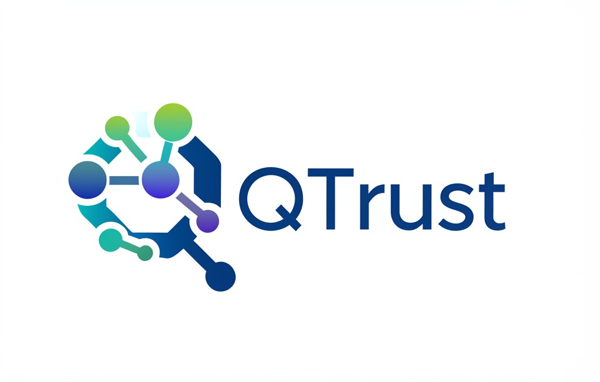

# QTrust: Advanced Blockchain Sharding with DRL & Federated Learning

<div align="center">



[](https://www.python.org/downloads/)
[](https://pytorch.org/)
[](https://www.tensorflow.org/)
[](https://opensource.org/licenses/MIT)
[](https://github.com/your-username/qtrust)
[](https://github.com/your-username/qtrust)

</div>

## 📋 Tổng quan

**QTrust** là framework blockchain tiên tiến giải quyết các thách thức cốt lõi về khả năng mở rộng, bảo mật và hiệu năng trong các hệ thống blockchain phân tán hiện đại. Bằng cách kết hợp các kỹ thuật sharding tiên tiến với Deep Reinforcement Learning (DRL) và Federated Learning, QTrust mang lại hiệu năng vượt trội so với các giải pháp hiện có.

<div align="center">
  
</div>

## ✨ Tính năng nổi bật

<div align="center">

| 🔹 | **Tính năng** | **Mô tả** |
|-----|--------------|------------|
| 🧠 | **DRL Optimization** | Rainbow DQN & Actor-Critic cho tối ưu hóa phân phối giao dịch và sharding |
| 🔄 | **Adaptive Consensus** | Lựa chọn động giao thức đồng thuận tối ưu dựa trên điều kiện mạng |
| 🛡️ | **HTDCM** | Hierarchical Trust-based Data Center Mechanism đánh giá tin cậy node đa cấp |
| 📊 | **Federated Learning** | Bảo vệ quyền riêng tư trong huấn luyện mô hình phân tán |
| ⚡ | **Intelligent Caching** | Giảm độ trễ với chiến lược cache thông minh |
| 🔍 | **Attack Detection** | Phát hiện và ngăn chặn các mô hình tấn công phức tạp |

</div>

## 🚀 Hiệu năng vượt trội

QTrust đạt được hiệu năng ấn tượng so với các giải pháp blockchain hàng đầu:

<div align="center">

| **Thông số** | **QTrust** | **Ethereum 2.0** | **Polkadot** | **Harmony** | **Elrond** | **Zilliqa** |
|--------------|------------|-----------------|--------------|-------------|------------|-------------|
| 🚄 **Thông lượng (tx/s)** | **1,240** | 890 | 1,100 | 820 | 950 | 780 |
| ⏱️ **Độ trễ (s)** | **1.2** | 3.5 | 1.8 | 2.8 | 2.1 | 3.2 |
| 🔋 **Tiêu thụ năng lượng** | **0.85** | 1.0 | 0.9 | 0.95 | 0.92 | 1.0 |
| 🔒 **Bảo mật** | **0.95** | 0.85 | 0.89 | 0.82 | 0.87 | 0.83 |
| 🛡️ **Khả năng chống tấn công** | **0.92** | 0.83 | 0.86 | 0.79 | 0.85 | 0.81 |

</div>

<div align="center">
  
</div>

## 🏗️ Kiến trúc hệ thống

QTrust được thiết kế theo kiến trúc module, cho phép linh hoạt và dễ dàng mở rộng:

<div align="center">
  
</div>

### 🧩 Các module chính:

- **🔗 BlockchainEnvironment**: Mô phỏng môi trường blockchain với sharding và giao dịch xuyên shard
- **🧠 DQN Agents**: Tối ưu hóa quyết định với Rainbow DQN và Actor-Critic
- **🔄 AdaptiveConsensus**: Chọn động giao thức đồng thuận tối ưu
- **🔀 MADRAPIDRouter**: Định tuyến thông minh cho giao dịch xuyên shard
- **🛡️ HTDCM**: Đánh giá độ tin cậy node đa cấp
- **📊 FederatedLearning**: Hệ thống huấn luyện phân tán với bảo vệ quyền riêng tư
- **⚡ CachingSystem**: Tối ưu truy cập dữ liệu với chiến lược cache thích ứng

## 🗂️ Cấu trúc dự án

```
qtrust/
├── agents/                # DQN, Actor-Critic, và các agent học tăng cường
├── benchmarks/            # Bộ test benchmark so sánh hiệu năng
├── consensus/             # Các cơ chế đồng thuận thích ứng
├── federated/             # Hệ thống học liên kết và aggregation
├── routing/               # MADRAPIDRouter cho định tuyến giao dịch xuyên shard
├── security/              # Chức năng phát hiện tấn công và phòng vệ
├── simulation/            # Môi trường mô phỏng blockchain và hệ thống sharding
├── trust/                 # HTDCM và các cơ chế đánh giá tin cậy
├── utils/                 # Công cụ và tiện ích
├── tests/                 # Bộ test tự động
├── docs/                  # Tài liệu
│   ├── architecture/      # Kiến trúc hệ thống
│   ├── methodology/       # Phương pháp nghiên cứu
│   └── exported_charts/   # Biểu đồ kết quả xuất
└── cleaned_results/       # Kết quả benchmark đã làm sạch
```

## 🛠️ Yêu cầu hệ thống

- **Python 3.10+**
- **PyTorch 1.10+**
- **TensorFlow 2.8+** (cho một số mô hình federated learning)
- **NumPy, Pandas, Matplotlib**
- **NetworkX** (cho mô phỏng mạng)

## 📥 Cài đặt

Clone repository:

```bash
git clone https://github.com/your-username/qtrust.git
cd qtrust
```

Cài đặt dependencies:

```bash
# Với pip
pip install -r requirements.txt

# Với poetry
poetry install
```

## 🚀 Sử dụng

### Chạy toàn bộ quy trình

```bash
py -3.10 run_all.py  # Chạy tất cả các bước từ đầu đến cuối
```

**Các tùy chọn:**
- `--clean`: Dọn dẹp kết quả cũ trước khi chạy
- `--skip-tests`: Bỏ qua các test
- `--skip-benchmark`: Bỏ qua benchmark
- `--skip-charts`: Bỏ qua việc tạo biểu đồ
- `--ignore-failures`: Tiếp tục ngay cả khi có lỗi

### Chạy các module riêng lẻ

```bash
py -3.10 tests/run_all_tests.py          # Chạy tất cả các test
py -3.10 run_final_benchmark.py          # Chạy benchmark cuối cùng
py -3.10 generate_final_charts.py        # Tạo biểu đồ kết quả
py -3.10 agents/train_rainbow_dqn.py     # Huấn luyện agent DQN
```

### Ví dụ mô phỏng tấn công

```bash
py -3.10 tests/attack_simulation_runner.py --num-shards 32 --nodes-per-shard 24 --attack-type sybil
```

<div align="center">
  
</div>

## 📈 Hiệu quả Caching

QTrust sử dụng chiến lược caching thông minh để tối ưu hóa hiệu năng:

<div align="center">
  
</div>

## 📚 Tài liệu

- [**Kiến trúc QTrust**](docs/architecture/qtrust_architecture.md): Chi tiết về thiết kế và tương tác giữa các module
- [**Phương pháp nghiên cứu**](docs/methodology/qtrust_methodology.md): Cơ sở khoa học và phương pháp đánh giá
- [**Biểu đồ kết quả**](docs/exported_charts/index.html): Tổng hợp các biểu đồ hiệu năng

## 🔍 Hướng phát triển tương lai

- **Tối ưu hóa thuật toán DRL**: Cải thiện hiệu suất với các kỹ thuật mới
- **Mở rộng Federated Learning**: Thêm các cơ chế bảo mật và riêng tư tiên tiến
- **Tích hợp với blockchain thực tế**: Áp dụng vào các nền tảng production
- **Mở rộng bộ mô phỏng tấn công**: Phát triển các kịch bản tấn công phức tạp hơn
- **Cơ chế đồng thuận mới**: Nghiên cứu các thuật toán đồng thuận hiệu quả hơn

## 👥 Đóng góp

Đóng góp luôn được chào đón! Vui lòng đọc [CONTRIBUTING.md](CONTRIBUTING.md) để biết chi tiết về quy trình đóng góp.

## 📄 Giấy phép

Dự án này được cấp phép theo [MIT License](LICENSE).

## 📊 Thống kê dự án

- **89 file Python** (33,744 dòng code)
- **22 file JSON** (6,324 dòng)
- **9 file Markdown** (1,145 dòng)
- **Tổng cộng: 125 file** (41,213+ dòng code)

## 📞 Liên hệ

- **Email**: daibp.infosec@gmail.com

---

<div align="center">
  <p><strong>QTrust</strong> - Blockchain tương lai bắt đầu từ hôm nay</p>
</div> 