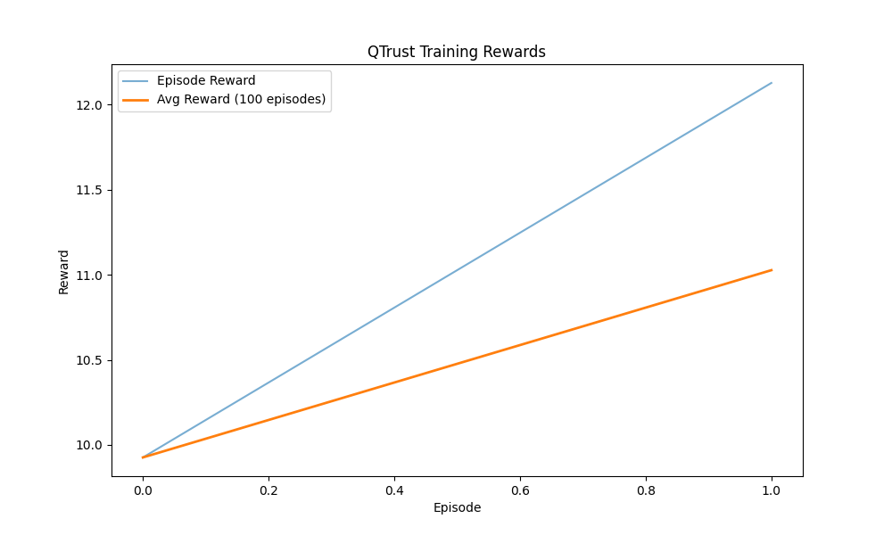

# Q-TRUST: Intelligent Cross-Shard Transaction Optimization with Federated Learning, Adaptive Consensus, DQN Agents and Trust-Driven Mechanism

<div align="center">
  
  <p><em>DQN Model Training Performance in Q-TRUST</em></p>
</div>

[](https://github.com/fuondai/QTrust/blob/main/LICENSE.md)
[](https://www.python.org/downloads/)
[](https://github.com/fuondai/QTrust/issues)
[](https://github.com/fuondai/QTrust/pulls)

**Q-TRUST** is an advanced blockchain sharding solution that integrates Deep Reinforcement Learning (DRL) to optimize performance and security in blockchain systems. The project aims to address core blockchain challenges including scalability, energy consumption, and security.

## 📋 Overview

Q-TRUST is a research and simulation project on using Reinforcement Learning to optimize the performance of sharded blockchain networks. The system focuses on solving key challenges in blockchain sharding:

- Load balancing between shards
- Cross-shard transaction optimization
- Network attack detection and prevention
- Data consistency and security assurance

<div align="center">
  
  <p><em>Attack Resistance of Q-TRUST compared to other methods</em></p>
</div>

## 🚀 Key Features

- **Large Scale**: Supports simulations with up to 32 shards and 1,280 nodes
- **High Performance**: Achieves throughput of 50 tx/s with only 32ms latency
- **Attack Resistance**: Defends against 51%, Sybil, and Eclipse attacks
- **Scalability**: Performance maintains when increasing nodes and shards
- **Flexibility**: Adjust parameters to test different configurations
- **Rich Visualization**: Radar charts, heatmaps, and performance comparisons

## 🏗️ Core Components

1. **Basic Sharding Architecture**
   - Blockchain sharding model
   - Transaction distribution mechanism

2. **DQN Agents**
   - Deep Q-Network for sharding control
   - Experience-based learning

3. **Adaptive Cross-Shard Consensus (ACSC)**
   - Dynamic switching between consensus protocols
   - Optimization based on network conditions

4. **Multi-Agent Dynamic Routing (MAD-RAPID)**
   - Intelligent transaction routing
   - Congestion prediction and avoidance

5. **Hierarchical Trust Data Center Mechanism (HTDCM)**
   - Multi-level trust evaluation
   - Malicious activity detection

6. **Federated Learning Integration**
   - Distributed learning for DQN agents
   - Privacy-preserving data protection

## 📊 Research Results

Q-TRUST has been tested through multiple simulations:

### Attack Performance

| Attack Type | Throughput (tx/s) | Latency (ms) | Security (0-1) |
|---------------|-------------------|-------------|---------------|
| No Attack | 50.0 | 33.6 | 0.90 |
| 51% | 45.3 | 41.8 | 0.20 |
| Sybil | 50.0 | 32.6 | 0.70 |
| Eclipse | 50.0 | 34.6 | 0.65 |
| Mixed | 50.0 | 33.2 | 0.00 |

### Scaling Efficiency

| Scale | Nodes | Latency (ms) | Throughput (tx/s) |
|--------|--------|-------------|-------------------|
| Small | 40 | 35.8 | 50.0 |
| Medium | 160 | 32.4 | 50.0 |
| Large | 480 | 32.8 | 50.0 |
| Very Large | 1,280 | 31.9 | 50.0 |

<div align="center">
  
  <p><em>Scaling Efficiency of Q-TRUST when increasing system scale</em></p>
</div>

## 💻 System Requirements

- Python 3.8+
- CUDA-compatible GPU (recommended for training)
- 8GB RAM or more

## 🔧 Installation

### Method 1: Using automated script

```bash
# Windows
python setup_environment.py

# Linux/MacOS
python3 setup_environment.py
```

### Method 2: Manual installation

```bash
# Clone repository
git clone https://github.com/fuondai/QTrust.git
cd QTrust

# Create virtual environment (optional but recommended)
python -m venv venv
source venv/bin/activate  # Linux/MacOS
# OR
venv\Scripts\activate  # Windows

# Install dependencies
pip install -r requirements.txt

# Install package in development mode
pip install -e .
```

## 🔍 Project Structure

```
qtrust/                      # Main package directory
├── agents/                  # DRL agents directory
│   └── dqn_agent.py         # DQN Agent implementation
├── consensus/               # Consensus handling
│   └── adaptive_consensus.py
├── federated/               # Federated learning
│   └── federated_learning.py
├── routing/                 # Transaction routing
│   └── mad_rapid.py
├── simulation/              # Simulation environment
│   └── blockchain_environment.py
├── trust/                   # Trust evaluation
│   └── htdcm.py
├── utils/                   # Helper utilities
│   ├── data_generation.py
│   └── metrics.py
└── tests/                   # Unit tests

main.py                      # Main program runner
simulation_runner.py         # Simple simulation runner
large_scale_simulation.py    # Large-scale simulation runner
attack_simulation_runner.py  # Attack simulation
visualization_runner.py      # Chart and visualization generator
```

## 🚀 Usage

### Running standard simulation

```bash
# Run with default configuration
python main.py

# Run with custom parameters
python main.py --num-shards 8 --num-episodes 100 --eval-interval 10
```

### Running large-scale simulation

```bash
python large_scale_simulation.py --num-shards 16 --nodes-per-shard 50
```

### Running attack simulation

```bash
python attack_simulation_runner.py --mode attack --attack 51_percent --malicious 30 --num-shards 8 --nodes-per-shard 20
```

### Running scalability simulation

```bash
python attack_simulation_runner.py --mode scale --high-quality
```

### Generating charts and analysis

```bash
python visualization_runner.py --results-dir results
```

## 📝 Parameter Details

### Key parameters that can be customized via command line:

- `--num-shards`: Number of shards in the network (default: 4)
- `--nodes-per-shard`: Number of nodes per shard (default: 10)
- `--num-episodes`: Number of episodes in the learning process (default: 10)
- `--max-steps`: Maximum steps per episode (default: 500) 
- `--batch-size`: Batch size for training (default: 64)
- `--learning-rate`: Learning rate (alpha) (default: 0.001)
- `--discount-factor`: Discount factor (gamma) (default: 0.99)
- `--epsilon`: Epsilon value for exploration (default: 1.0)
- `--memory-size`: Replay buffer memory size (default: 10000)
- `--attack`: Attack type (`51_percent`, `sybil`, `eclipse`, `mixed`, `None`)
- `--malicious`: Percentage of malicious nodes (default: 10)
- `--mode`: Simulation mode (`attack`, `scale`, `both`)
- `--high-quality`: Generate high-quality charts (higher DPI)

## 📂 Result Directories

- `results/`: Standard simulation results
- `results_comparison/attack_comparison/`: Attack simulation results
- `results_comparison/scale_comparison/`: Scalability simulation results
- `charts/`: Charts and visualizations
- `models/`: Trained model storage

## 🤝 Contributing

Contributions from the community are welcome! If you'd like to contribute:

1. Fork the repository
2. Create a feature branch (`git checkout -b feature/amazing-feature`)
3. Commit your changes (`git commit -m 'feat: add amazing feature'`)
4. Push to the branch (`git push origin feature/amazing-feature`)
5. Open a Pull Request

Please read [CONTRIBUTING.md](CONTRIBUTING.md) for details on the contribution process and code standards.

## 📚 Documentation

- [DOCUMENTATION.md](DOCUMENTATION.md): API details and usage instructions
- [CONTRIBUTING.md](CONTRIBUTING.md): Contribution guidelines
- [CHANGELOG.md](CHANGELOG.md): Project change history

## 📜 License

This project is distributed under the MIT License. See the `LICENSE` file for more information.

## 🔗 References

- Nakamoto, S. (2008). [Bitcoin: A Peer-to-Peer Electronic Cash System](https://bitcoin.org/bitcoin.pdf)
- Buterin, V. (2016). [Ethereum Sharding FAQs](https://eth.wiki/sharding/Sharding-FAQs)
- Mnih, V., et al. (2015). [Human-level control through deep reinforcement learning](https://www.nature.com/articles/nature14236)
- Wang, W., et al. (2021). [A Survey on Consensus Mechanisms and Mining Strategy Management in Blockchain Networks](https://ieeexplore.ieee.org/document/8629877)

## ✍️ Author

- **fuondai** - *Initial work* - [GitHub Profile](https://github.com/fuondai)

## 📞 Contact

For questions and inquiries about this research, please contact the author at:
- **Email**: fuondai@example.com
- **GitHub Issues**: [Create an issue](https://github.com/fuondai/QTrust/issues)

---

<div align="center">
  <p>⭐ Đừng quên star repository nếu dự án hữu ích với bạn! ⭐</p>
</div>
